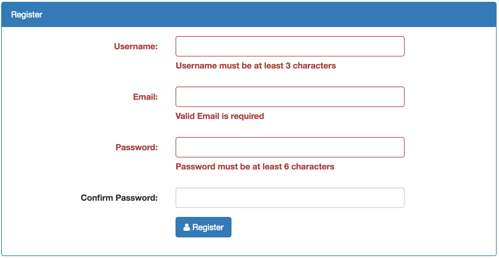
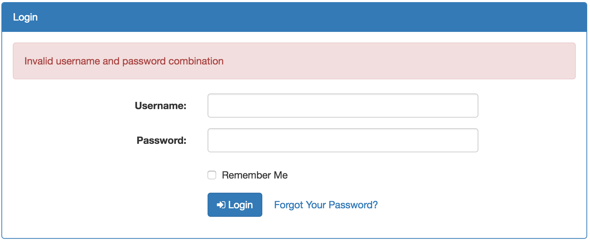
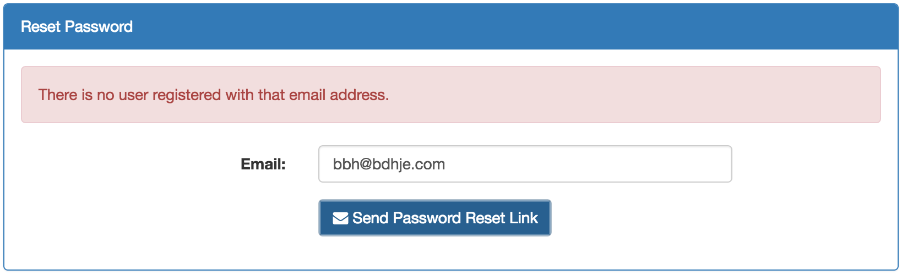
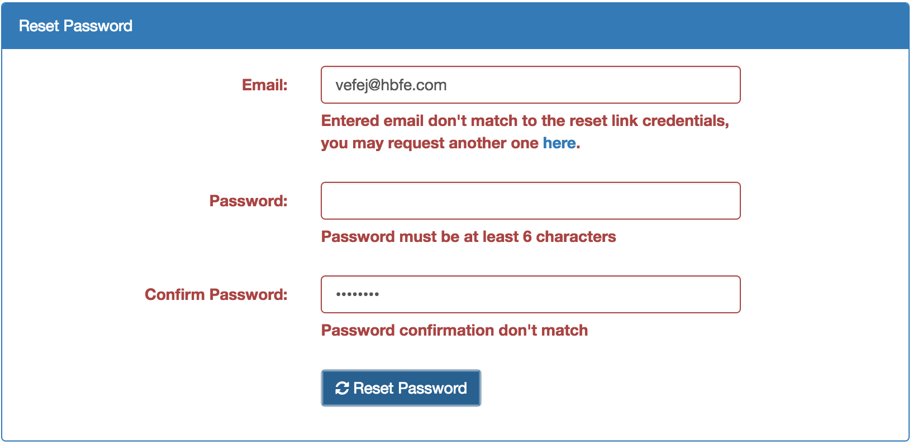

# wp-user-auth-bootstrap
Plugin for allowing users to register into your WordPress site via AJAX using the rest-api. Still in the work.

# NOTE:
This is not meant to be distributed since it only suits to specific use cases. It doesn't offer an options page to add or remove fields. This is geared toward developers who want to use it as a starting point and add their own code on top of it.

This plugin assumes that your theme is using bootstrap and font-awesome. If not then style it however you wish.

# Shortcodes:
1. [register-form]
2. [login-form]
3. [send-reset-link-form]
4. [password-reset-form] - Will redirect user to home page if he randomly accesses that page.
5. [update-user-form] - Will redirect user to home page if he's not logged in.
6. [update-password-form] - Will redirect user to home page if he's not logged in.

#Security
If you use this plugin you use it at your own risk, however I tried to use the best practices and I relied on WordPress functions whenever I could. Codebase is very small so you can go over the includes/api folder and take a look how I process all requests. It's mostly form validation and the rest is WordPress helper functions. I don't deal with SQL queries directly so there shouldn't be any problems. If you do find one, please let me know so I can fix it.

# Screenshots
[register-form]

[login-form]

[send-reset-link-form]

[password-reset-form]

